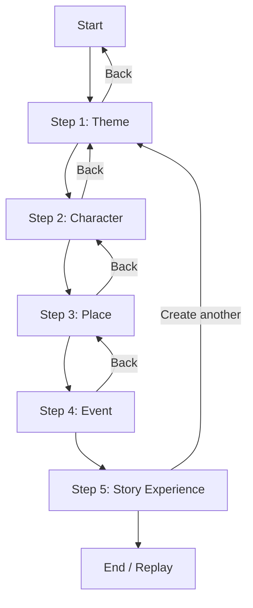
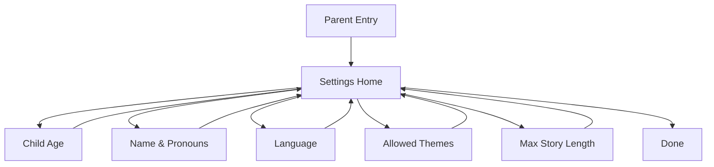

# UX Artefacts - User Flows

This file documents the primary child flow and the parent settings flow.

## 1) Child Flow (5-step story creation)

## 2) Parent Flow (Out-of-band settings)

## 3) Edge Paths & Recovery

- Incomplete flow: allow "Resume story" from Step 1 if last session is mid-flow.
- Timeout: if idle for N seconds, pause animations and show a gentle "Continue" prompt.
- Safe retry: if story generation fails, show a single-tap "Try again" with calming copy.
