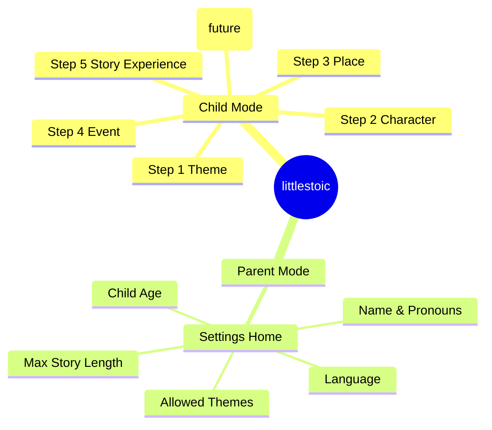

# UX Artefacts - Information Architecture

## App Map

## Navigation Rules

- Child Mode uses a single forward/back stack with no global navigation.
- Parent Mode is a separate route group with a small hub-and-spoke pattern.
- No cross-links from Child Mode to Parent Mode (use parent gate).

## Entry Points

- App launch defaults to Child Mode Step 1.
- Parent Mode entry is a discrete action behind a simple gate.
